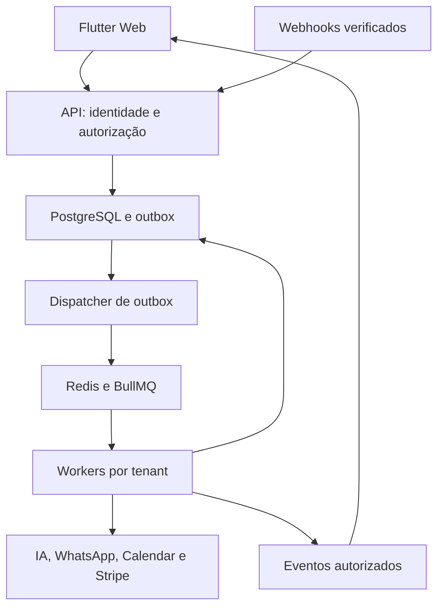

# Arquitetura

Estado: desenho de referência da v1, sujeito à revisão do PR de Phase 0. Requisitos §§2–4, 67–78, 86, 115–117, 124–135.

## Estrutura e fronteiras

Monólito modular NestJS com dois processos independentes (API e workers), PostgreSQL como fonte de verdade, Redis para filas/cache/locks e storage privado. O mesmo motor serve todos os tenants. Escalar workers por fila antes de extrair serviços. Nunca criar um workflow por cliente.

Chamadas externas não decorrem dentro de transações longas de base de dados. Transação de domínio grava também o evento outbox; dispatcher confirma enfileiramento; consumidor usa uma chave durável de deduplicação. A entrega é pelo menos uma vez; não alegar exactly-once entre sistemas externos.

## Monorepo alvo

| Caminho | Conteúdo e criação |
|---|---|
| `apps/backend/src/main.ts`, `worker.ts` | Entrypoints API/worker na P1; módulos de domínio partilhados |
| `apps/backend/src/modules/` | Módulos abaixo, criados com implementação e testes |
| `apps/backend/src/common/` | Guards, filtros, contexto, redaction, errors; sem negócio |
| `apps/backend/prisma/` | Schema, migrations e seeds; única fonte física de migrations |
| `apps/backend/test/` | Unit/integration/E2E com PostgreSQL/Redis reais quando necessário |
| `apps/flutter_app/lib/` | app/core/shared/features, detalhados em Flutter UX |
| `packages/api-contracts/openapi/` | Contrato provisório agora; export automático NestJS na P1 |
| `packages/shared-config/` | Configs realmente partilhadas; não tipos TS importados por Dart |
| `infra/` | Compose, scripts, build, deployment por ambiente |
| `docs/decisions/` | ADRs e histórico de decisões |
| `.github/workflows/` | Gates verificáveis, adicionados com código executável |

A árvore original é alvo ilustrativo. Organizar domínios sob `modules/` e unificar `shared_contracts/api_types` em `api-contracts` evita duplicação; não elimina requisitos. Não gerar ficheiros vazios só para reproduzir a árvore.

## Módulos e propriedade

| Módulos | Propriedade | Dependências permitidas |
|---|---|---|
| config, database, redis, queue, health | Infraestrutura, transações e contexto | Bibliotecas e adapters |
| auth, users, tenants, memberships, rbac | Identidade, sessões, autorização | Database, audit, email |
| onboarding, industries, services, business-hours, staff, faqs, policies, settings | Configuração e progresso | TenantContext, repositories |
| customers, channels, messages, conversations, leads | Relação com clientes e pipeline | Outbox, storage, queue |
| ai, agents, ai-tools | Contexto, provider, configs, registry/executor | Interfaces de domínio; nunca SQL vindo do modelo |
| bookings, calendars | Disponibilidade, ocupação, sync | PostgreSQL, CalendarProvider |
| handoff, notifications, realtime | Propriedade da conversa e entrega UI | ConversationService, event stream |
| billing, plans, subscriptions, usage | Entitlements, ledger e custos | BillingProvider, outbox |
| analytics, audit, admin, feature-flags, jobs | Operação, suporte e agregação | Serviços autorizados e read models |
| storage, email, events, webhooks | I/O, contratos de eventos e ingress | Interfaces e adapters por provider |

Controllers validam transporte e chamam application services. Repositories recebem contexto verificado e transaction client; domain services não conhecem HTTP. Dependências injetadas por tokens. Eventos versionados (`event_id`, `schema_version`, `tenant_id`, `aggregate_id`, `occurred_at`, `correlation_id`) desacoplam efeitos; invariantes síncronas continuam em transações.

## Fluxo de mensagem e fairness

Webhook verificado → routing server-side → external_event + inbound message + outbox numa transação → ACK → fila incoming → debounce 1–2s limitado por janela máxima → processamento por conversa → tools autorizadas → outbound intent persistido → fila outgoing → provider → estados de entrega.

Uma conversa por vez, com lease renovável e fencing/version no PostgreSQL. Limites de concorrência por tenant e por provider evitam que um tenant monopolize workers. Nenhum segredo ou corpo completo de conversa em jobs/logs. Jobs contêm referências e contexto de routing verificado, revalidado no consumo.

## Consistência e escala

- PostgreSQL conserva mensagens, reservas, ledger, outbox e estado de processamento mesmo após perda de Redis.
- Redis não decide disponibilidade nem autoridade de tenant. Sem Redis, readiness falha; webhooks só recebem sucesso se houver persistência durável e capacidade de recuperação.
- Cache keys incluem ambiente, tenant e versão de configuração. Invalidação após commit; TTL limitado.
- Listas usam cursor e índices tenant-first; dashboards leem agregados. Partitioning só com medição e sem quebrar constraints de unicidade.
- Targets de §95 são objetivos a medir, não resultados atuais: API normal p95 <500ms e ACK webhook <1s.
