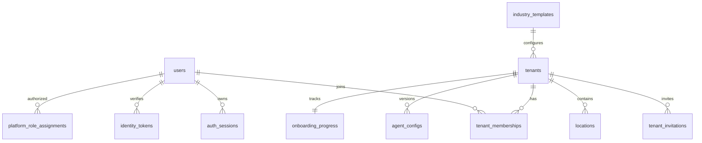
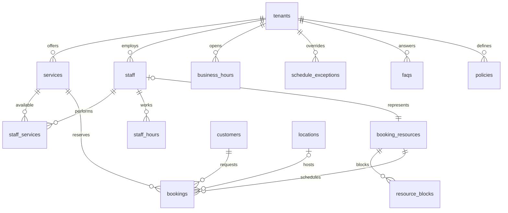
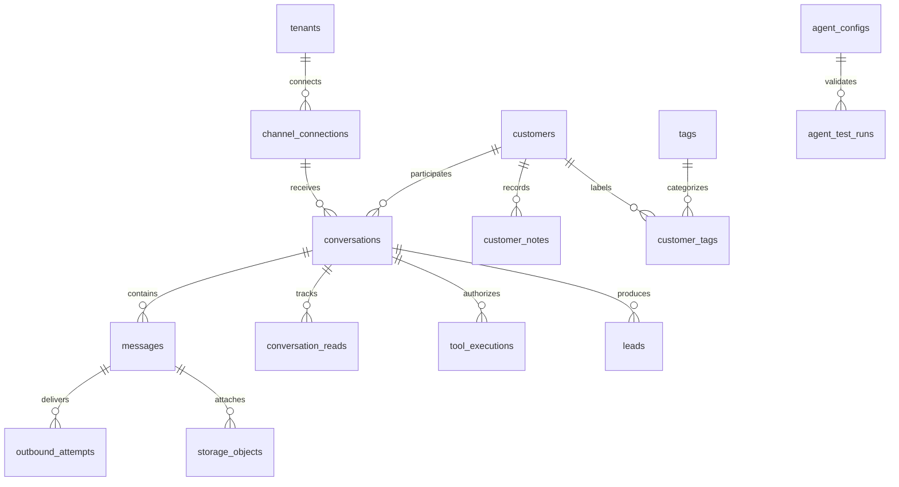
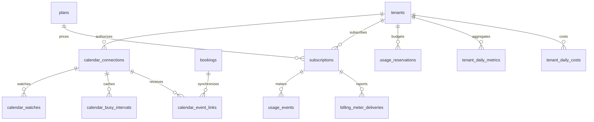
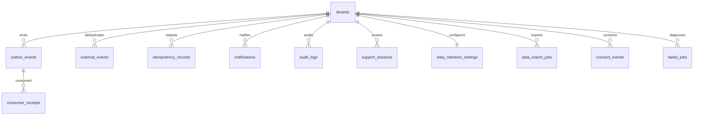

# Modelo de dados e ERD

Modelo lógico v1. Os campos mínimos de cada tabela em `SPECIFICATION.md` continuam obrigatórios; este documento acrescenta relações, invariantes e tabelas de suporte. P1/P2 já incluem schema físico e migrations executáveis para infraestrutura, identidade, sessões, tenants, memberships, convites e auditoria. O restante ERD continua a ser o modelo alvo, implementado incrementalmente. Ver [Phase 2](phase-2.md).

## Convenções

UUID para identidades, snake_case na DB, `timestamptz` para instantes UTC; `date`/`time` locais para horários recorrentes e exceções, associados a timezone IANA. Valores monetários `numeric(20,6)` + ISO-4217, strings decimais na API, nunca float; validar escala conforme moeda, arredondamento explícito na fronteira Stripe. Tokens e metering usam inteiros/bigint. `created_at`, `updated_at`, `deleted_at` quando adequado; enums estáveis com migrations.

Entidades de negócio têm `tenant_id NOT NULL`, `UNIQUE(tenant_id,id)` e FKs compostas. Relações globais (user, template, plan) são exceções documentadas. Índices tenant-first sobre ordenação e lookup. Soft delete filtra por defeito, sem ocultar referências históricas de bookings/faturas.

## ERD por domínio

Cardinalidades representam relações lógicas; todos os filhos respeitam FKs de tenant. Feature flags e incidents são catálogos/operacionais com scopes explícitos (abaixo). Tenant pode ter múltiplos recursos, incluindo exatamente um default quando não há staff; recurso de staff só existe quando este participa em bookings. IDs opcionais de histórico não permitem fuga cross-tenant.

## Dicionário e invariantes adicionais

| Entidades | Campos/constraints além da especificação |
|---|---|
| users, auth_sessions, identity_tokens | email normalizado único; password_hash; email_verified_at; sessions com refresh_hash, family_id, expires_at, revoked_at; tokens verify/reset com finalidade e used_at |
| tenant_memberships, tenant_invitations | unique tenant/user; invitation token_hash, email, role, expiry; impedir último owner removido; platform roles em tabela separada |
| tenants, onboarding_progress | `operational_status` separado de subscription/provisioning; version; passos e último passo; revisão de config testada; aceites legais em consent_events |
| industry_templates | Catálogo das 12 indústrias de §7; key única e versão para não modificar configurações já publicadas |
| services, staff_services | duration >0, buffers >=0, price >=0; unique tenant/staff/service; duração/preço custom validados |
| business_hours, staff_hours, schedule_exceptions | weekday 0–6 convencionado (0 domingo), start < end; períodos noturnos divididos por dia; sem sobreposição; exceção pode referir staff/location e tem precedência explícita |
| staff, locations, booking_resources | resource tem kind default/staff, staff_id opcional, timezone/location; default único por tenant; MVP capacidade 1; location preparada, UI multi-location diferida |
| customers | unique tenant/phone_e164 quando preenchido; automation_blocked; notas/tags separadas com autoria e permissões |
| faqs, policies | Pergunta/resposta/categoria/active; policies com tipo, texto, configuração validada e versão |
| channel_connections | Provider + external_phone_id único ativo; credentials_reference e estado; reassociação exige desligar conexão anterior e auditar |
| conversations | version/fencing, last_processed_message_id, mode_epoch, resolved_without_human, human_participated; customer/channel; thread ativa controlada por índice parcial |
| messages | unique provider/connection/external_message_id quando presente; sequência monotónica por conversa; inbound/outbound status; `execution_mode` live/sandbox se aplicável; sem credenciais no JSON |
| conversation_reads | Unique tenant/conversation/user e last_read_sequence; contador não lido não global |
| agent_configs, agent_test_runs | unique tenant/version; uma versão publicada ativa; snapshot hash; testes registam config hash, resultados e provider/model; publish invalida teste anterior |
| tool_executions | tenant/conversation/turn/action_key única, tool, input_hash, outcome sanitizado, status; idempotência de efeitos, não só de pedidos de modelo |
| bookings | resource_id obrigatório; start/end, occupied_start/end incluem buffers; price/duration snapshot; version; confirmação/consentimento do cliente; booking_revisions para histórico de remarcações |
| resource_blocks | tenant/resource, intervalo, motivo; alterações serializadas com bookings para impedir bloqueio a sobrepor reserva existente sem tratamento explícito |
| calendar_connections, calendar_watches | sync_token, sync_version, last_success, stale status; watch channel/resource IDs, token hash, expiry; unique provider/calendar no âmbito permitido |
| calendar_busy_intervals, calendar_event_links | Busy range sem expor título externo; links unique connection/booking e connection/external_event_id; ETag e última versão enviada |
| plans, subscriptions | Valores de §43 são seed de exemplo editável; versões/preços imutáveis para histórico; uma subscrição corrente por tenant; IDs Stripe únicos |
| usage_events, usage_reservations | Ledger append-only, dedup_key única; amount/currency e price_version para custo; reservas atómicas de quota com expiry e settlement |
| billing_meter_deliveries | unique provider/subscription/event_key, provider receipt, attempts/status; não recobrar ao repetir jobs |
| tenant_daily_metrics, tenant_daily_costs | unique tenant/date/timezone_version; currency nos custos; revisões/agregações reconstruíveis do ledger; nunca somar moedas diferentes |
| external_events | unique provider/external_event_id; tenant resolvido, payload_hash, processing_status, attempts; WhatsApp status pode exigir ID derivado de message/status/timestamp |
| provider_ingress_events | Âmbito global restrito apenas enquanto não resolvido; hash, provider e payload mínimo cifrado/retido por prazo curto; nunca acessível via tenant APIs |
| outbox_events, consumer_receipts | event UUID, payload versionado, published_at, attempts; unique consumer/event; recibo na mesma transação dos efeitos locais |
| idempotency_records | unique tenant/actor/operation/key; request_hash, response, status, expiry; mesma chave com payload diferente = conflito |
| notifications | tenant/recipient/event/type unique; read_at, delivery status; email delivery separado quando necessário |
| audit_logs, support_sessions | actor real, effective actor, reason, tenant, expiry; audit append-only, before/after redacted; eventos globais apenas em repositório admin |
| storage_objects | tenant, owner, object_key, MIME, byte_size, checksum, scan_status, retention; signed URL gerada, não persistida como segredo |
| data_retention_settings, consent_events, data_export_jobs | Categorias/prazos; purpose/version/granted/revoked; job status, actor, object ref e expiry |
| feature_flags, feature_flag_overrides | Flag global; override com scope environment/tenant/plan e percentagem determinística; não substitui entitlement |
| failed_jobs, incidents | IDs da fila e tenant quando resolvido; payload sanitizado; retry/discard auditados; incidents com scope e estado |

## Garantia de reservas

Persistir limites de ocupação calculados a partir do serviço e buffers do momento da reserva. Migration SQL acrescenta exclusão GiST em `(tenant_id =, resource_id =, tstzrange(occupied_start_at, occupied_end_at, '[)') &&)` para status pending/confirmed. `btree_gist` permite combinar igualdade com ranges ([PostgreSQL](https://www.postgresql.org/docs/current/rangetypes.html)). Não usar staff_id nullable como único recurso de conflito.

Reschedule atualiza reserva sob lock e constraint; falha preserva intervalo anterior. Cancelamento retira estado ocupante na mesma transação. Constraints SQL especiais e RLS ficam em migrations revisadas; Prisma não é a única fonte de invariantes.

## Índices e retenção

Messages `(tenant_id,conversation_id,sequence)`; conversations `(tenant_id,last_message_at,id)`; customers `(tenant_id,phone_e164)` e pesquisa normalizada; bookings `(tenant_id,resource_id,start_at)` mais GiST; usage/audit `(tenant_id,occurred_at|created_at,id)`; outbox pendente `(published_at,created_at)` parcial. Paginação por cursor com ordenação estável. Índices de pesquisa textual apenas após planos de consulta medidos.

Purge elimina/anonimiza na ordem das FKs sem apagar ledger financeiro indiscriminadamente. Dados auditáveis retidos com política específica, minimizados; deletes são jobs com progresso e retries.

## Ordem de migrations

P1/P2: users/auth/tenants/memberships/invites/audit e catálogos; P3: configuração; P4: customers/channels/conversations/messages/outbox/receipts; P5: agent/tests/tools; P6: recursos/bookings/constraints; P7: calendar; P8: unread/notifications; P9: billing/ledger; P10: agregados/admin; P11: retenção e extensões. Infra de outbox/usage pode antecipar-se quando o primeiro consumidor precisar. Nunca marcar domínio completo por criar apenas tabela.

Extensões pós-MVP: tenant_api_keys (hash e prefixo, scopes, expiry/revocation), webhook_endpoints (secret reference, event allowlist, delivery log), RAG assets/chunks/embeddings. Ficam no backlog; sem migrations especulativas de features não implementadas.
